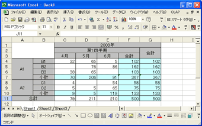
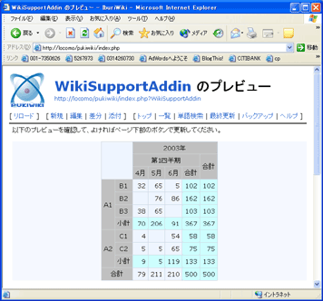
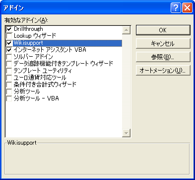
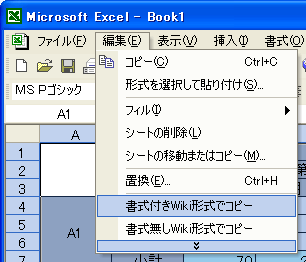

# Wiki サポート "Excel" アドイン

Excel シートの一部を PukiWiki の表形式に変換。隠れた人気ツール

## フリーウェアの Excel アドオン

Wiki サポートアドインは、Excel の指定範囲を PukiWiki フォーマットの表形式に変換する Excel アドオンです。

PukiWiki 上で複雑な表組みをする場合や、表組みが苦手な方はどうぞお試しください。

## ダウンロード

**[最新版インストーラをダウンロード](https://github.com/ideamans/wiki-support-addin/releases/download/v0.8.2/WikiSupportAddin082.exe)**

## クリップボード操作時にてエラーにつきまして

ご利用いただいている PC 環境によってはクリップボード操作時にてエラーが発生してしまうケースがございました。エラーへの対応方法としまして、RelaxTools さまより API 方式への変更をおこなうプログラムの公開をいただいております。

同様なエラーが発生してしまう方は以下リンク先からご確認いただきお試しいただければと思います。

- 紹介ページ：🔗 [https://github.com/RelaxTools/PukiWiki-Addin](https://github.com/RelaxTools/PukiWiki-Addin)
- ダウンロードページ：🔗 [https://github.com/RelaxTools/PukiWiki-Addin/releases](https://github.com/RelaxTools/PukiWiki-Addin/releases)

## 使い方

### 1. 表の範囲を選択

Excel 上で表を作成し、Wiki フォーマットに変換したい範囲を選択します。

`書式付きPukiWiki形式でコピー` を選択します。



### 2. PukiWiki 形式のテキストがコピーされます

以下のような PukiWiki 上での表組み形式のテキストがクリップボードにコピーされます。

```
|>|RIGHT:|>|>|>|>|BGCOLOR(#C0C0C0):CENTER:2003年|
|~|~|>|>|>|BGCOLOR(#C0C0C0):CENTER:第1四半期|BGCOLOR(#C0C0C0):CENTER:合計|
|~|~|BGCOLOR(#C0C0C0):CENTER:4月|BGCOLOR(#C0C0C0):CENTER:5月|BGCOLOR(#C0C0C0):CENTER:6月|BGCOLOR(#C0C0C0):CENTER:合計|~|
...(省略)
```

### 3. PukiWiki に貼り付け

PukiWiki のページに貼り付けると、カラーや文字寄せなど、一部の書式が維持された表組みが展開されます。



## インストール

### 1. インストーラのダウンロード

まずはインストーラをダウンロードしてください。

通常通り、ダブルクリックで起動し、ソフトウェアのインストールを進めてください。

#### 動作環境

次の環境で動作を確認しています。

- Windows XP 32bit + Excel 2000
- Windows XP 32bit + Excel 2003
- Windows 7 64bit + Excel 2007
- Windows 7 64bit + Excel 2010

**Mac OSX 版の Excel では利用できません。**

### 2. アドインの有効化

インストール後、Excel の `ツール` - `アドイン` 開き、`Wikisupport` にチェックをつけて OK ボタンを押します。



### 3. メニューの確認

`編集` メニューと、右クリックメニューに、`書式付きWiki形式でコピー` と `書式無しWiki形式でコピー` が追加されればインストール完了です。


